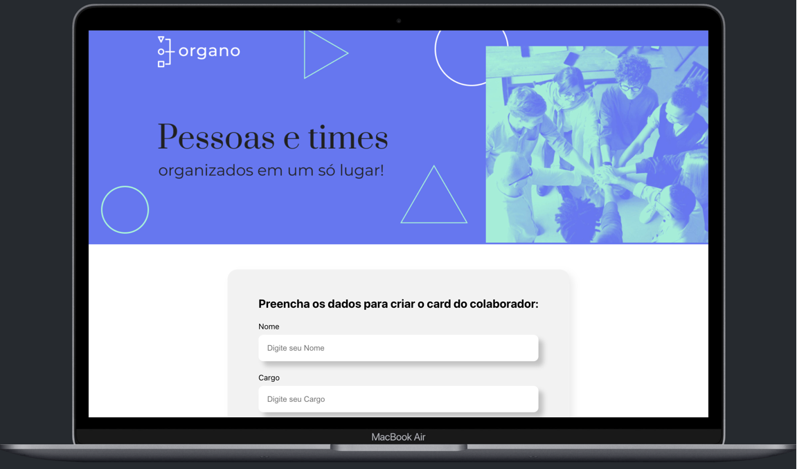

## Screenshots

## Projeto Alura Organo

Este repositório contém o projeto desenvolvido como parte do curso React: desenvolvendo com javascript da Alura. O objetivo deste projeto era criar um tela de cadastro dos colaboradores associando a cada respectivo time.

### ℹ️ Aprendizado

Durante o curso, aprofundei meu entendimento sobre a estrutura de componentes, focando na componentização, nos ciclos de vida dos componentes através dos Hooks, e na utilização eficaz das props para criar funções e componentes, aprendendo a posicioná-las digamos que na "camada" correta no código.

### 🚀 Tecnologias Utilizadas

- ReactJs
- JavaScript
- CSS3

### ℹ️ Como Utilizar

- Faça um clone deste repositório.
- Instale o node_modules
- Rode o comando npm start

### 🤝 Contribuição

Contribuições são sempre bem-vindas! Sinta-se à vontade para abrir uma issue ou um pull request para melhorias no projeto.

### Contato

- 🧑🏽‍💻 Wesley Teles
- 🔗 Link do meu portifólio: https://www.wesleyteles.com.br/
- 🔗 Link do projeto: https://organograma.netlify.app/
